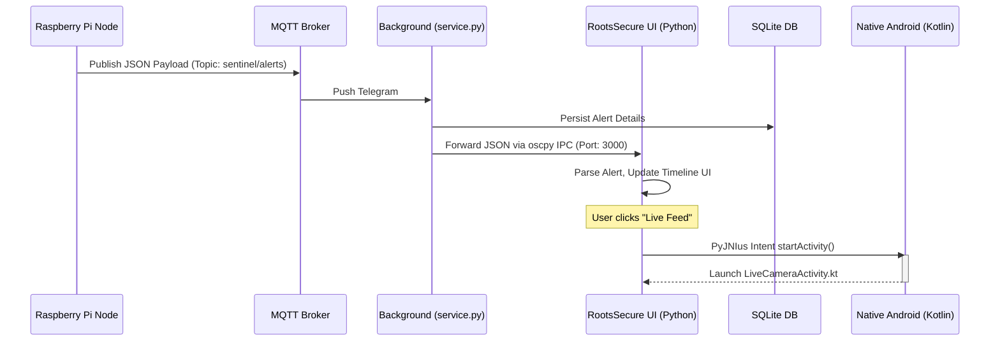

# RootsSecure (The "Digital Panopticon" Sentinel)


**RootsSecure** is a robust, end-to-end security and telemetry platform specifically designed for NRI plot owners. Embracing the "Digital Panopticon" design philosophy, it empowers users with live feeds, historical incident timelines, and algorithmic threat triaging across their physical real estate assets in India, managed seamlessly from abroad.

## System Architecture

The RootsSecure platform consists of a distributed, three-tiered data pipeline that efficiently evaluates threats locally before securely escalating them globally.

1. **Edge Layer (Hardware Sensing)**
   - Powered by a Raspberry Pi edge node deployed on-site.
   - Dual-stage Vision Pipeline:
     - **MOG2 Motion Gate**: Efficiently filters out static frames to preserve processing overhead.
     - **NCNN YOLO & Logic Engine**: Upon motion detection, quantized INT8 computer vision models detect specific objects (e.g., JCB machines, tractors, humans). The edge Logic Engine requires sustained confidence (e.g., a "5-frame rule") before escalating to minimize false positives such as birds or shadows.
     
2. **Transport Layer (Telemetry Gateway)**
   - **MQTT Broker**: Handles persistent, lightweight telemetry streaming (`paho-mqtt`).
   - Translates hardware triggers strictly into structured, low-latency JSON payloads ensuring instantaneous UI updates even over poor 3G/4G rural Indian cellular networks.

3. **Application Layer (Mobile Client)**
   - **Background Native Service**: A standalone `service.py` background process continuously listens to the broker, persisting incoming threats to a local SQLite database effortlessly.
   - **Android Wrapper**: Composed of native Kotlin classes (`MainActivity.kt`, `LiveCameraActivity.kt`) bridged directly to a robust **Kivy UI**. Python logic dictates state management and UI events natively.

## Technical Architecture Diagram



## The "Digital Panopticon" Design System

The application strictly adheres to the "Digital Panopticon" aesthetic rules prioritizing dark environments and sharp, high-contrast statuses to prevent user fatigue while clearly signifying alert severity to property owners.

### Color Palette
- **Base Environment (#131313)**: An Obsidian shade providing depth.
- **Teal Accent (#55D8E1)**: Utilized for the "Armed" system heartbeat and critical flashing overlays.
- **Amber & Crimson**: Used dynamically per threat level to indicate warnings or active soil theft parameters.

### Typography
- **Inter**: Selected for all primary headers, contextual messaging, and warnings ensuring maximum legibility.
- **Space Grotesk**: Enforced specifically for raw numerical telemetry (e.g., duration integers, confidence percentages, pixel manipulation ratios) evoking an objective, system-admin atmosphere.

## Detailed Setup & Build Guide

### 1. Windows "Simulation Mode" (Rapid Development)
To assist with UI testing without requiring an Android emulator over WSL2, the application possesses a smart Simulation Mode.
1. Run `python main.py` directly on your host Windows machine.
2. The `AlertHandler` automatically detects `kivy.utils.platform != 'android'`.
3. It bypasses MQTT networking requirements safely and generates localized, randomized JSON telemetry inputs simulating actual plot events locally onto your UI dashboard every 10 seconds.

### 2. Android Deployment (Buildozer over WSL2)
Compiling the `.apk` necessitates a Linux environment. On Windows machines, WSL2 (Ubuntu 22.04 LTS recommended) is required.
1. **Initialize WSL2 & Dependencies**: Ensure Java Development Kit `openjdk-17-jdk`, `git`, and build tools (`build-essential`, `cython`) are properly configured.
2. **Enter Project Directory**: Run `cd /mnt/d/Nri\ project/mobile_app`.
3. **Execute Compiler**: Command `buildozer android debug`.
4. Buildozer will download the NDK/SDK, pull `paho-mqtt` + `oscpy`, compile the Python wrapper, and output a raw `.apk` into the `/bin/` directory matching the `org.rootssecure.sentinel` domain ready for adb deployment.

## API / Payload Documentation

When the physical edge nodes generate alerts, they escalate them upwards matching the exact schema shown below. If extending the Python Edge script, ensure this precise dictionary shape is preserved.

```json
{
  "id": "evt_1684534800000",
  "type": "ILLEGAL_CONSTRUCTION",
  "level": "CRITICAL",
  "timestamp": "1684534800.00",
  "has_visual_proof": true,
  "metadata": {
    "duration_sec": 120,
    "confidence": 0.94,
    "trigger_source": "YOLO_JCB"
  }
}
```
- **id**: Unique event identifier (often an epoch combination). Ties directly to the downloaded 1080p image.
- **type**: The specific normalized category string (`SOIL_THEFT_ESCALATION`, `ILLEGAL_CONSTRUCTION`, `MOTION_DETECT`).
- **level**: Designation of urgency representing UI impact (`INFO`, `HIGH`, `CRITICAL`).
- **metadata.duration_sec**: Core parameter pulled by the dashboard for live telemetry "Time Since Detection".
