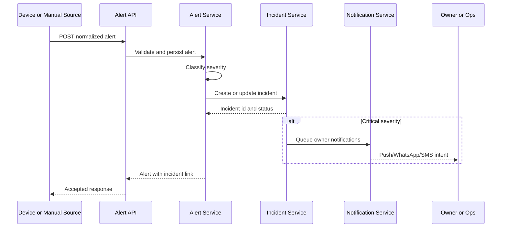
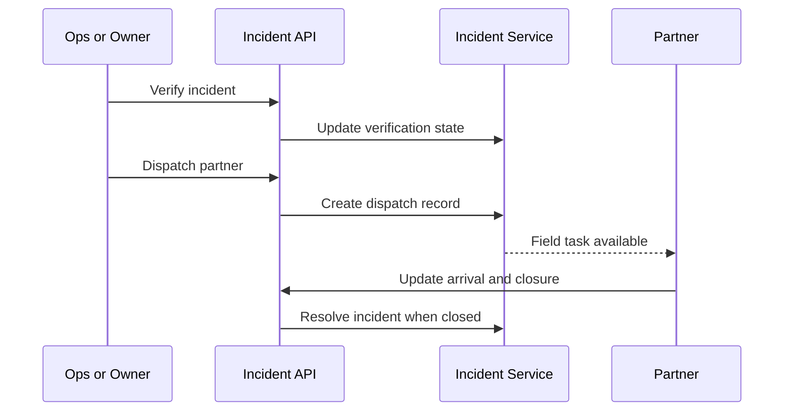

# Event Flow

## Alert to incident sequence

## Dispatch sequence

## Rules summary

- Tamper and gate breach default to critical.
- Repeated motion can escalate to critical.
- Offline events default to warning.
- Critical incidents auto-queue notifications.
- Resolution and dispatch updates always create audit logs.
