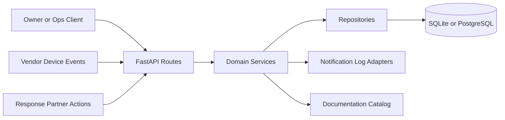

# System Overview

## Architecture style

The backend is a layered FastAPI application with explicit separation between HTTP routing, domain services, repository helpers, and persistence models.

## Layers

- API layer: request validation, auth dependencies, route composition
- Service layer: business logic, severity classification, incident lifecycle, dispatch decisions
- Repository layer: repeatable query helpers for users, properties, and incidents
- Persistence layer: SQLAlchemy models and Alembic migrations
- Documentation layer: markdown docs in-repo plus `/project-docs` HTML index

## Runtime components

- FastAPI app
- SQLAlchemy session factory
- SQLite local database in `data/`
- Notification log abstraction for push, WhatsApp, and SMS channels
- Background-ready incident workflow that can later be split into workers

## High-level flow

1. User authenticates and receives JWT tokens.
2. User creates a property and registers devices.
3. Devices send heartbeats and alerts.
4. The alert service classifies severity and creates or enriches an incident.
5. Notification logs capture intended outbound alerts.
6. Ops or owner verifies the incident.
7. A partner dispatch is created if field response is needed.
8. Evidence and closure proof are attached.

## Component diagram

